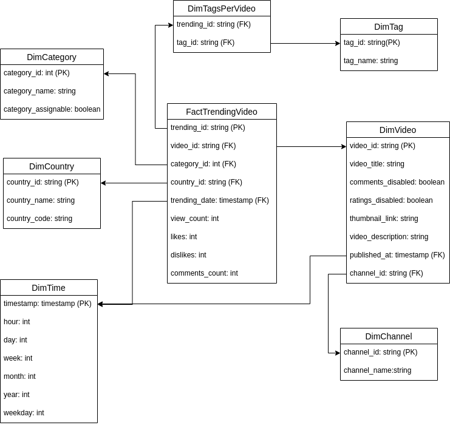
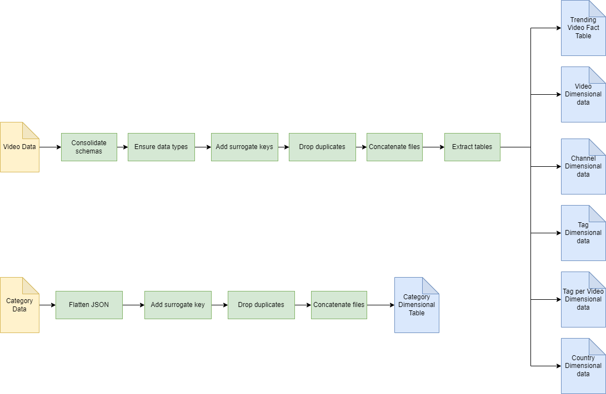

# Udacity Data Engineering Capstone Project

- [Udacity Data Engineering Capstone Project](#udacity-data-engineering-capstone-project)
  - [Project Description](#project-description)
  - [Project Structure](#project-structure)
  - [Steps of the Process](#steps-of-the-process)
    - [Step 1: Scope the Project and Gather Data](#step-1-scope-the-project-and-gather-data)
    - [Step 2: Explore and Assess the Data](#step-2-explore-and-assess-the-data)
    - [Step 3: Define the Data Model](#step-3-define-the-data-model)
      - [Rationale](#rationale)
    - [Step 4: Run ETL to Model the Data](#step-4-run-etl-to-model-the-data)
      - [Step 4.1: Data Pipeline](#step-41-data-pipeline)
      - [Step 4.2: Data Quality Checks](#step-42-data-quality-checks)
      - [Step 4.3: Data Dictionary](#step-43-data-dictionary)
        - [Trending Video Fact Table](#trending-video-fact-table)
        - [Video Dimensional Table](#video-dimensional-table)
        - [Channel Dimensional Table](#channel-dimensional-table)
        - [Tag Dimensional Table](#tag-dimensional-table)
        - [Tag-per-Video Dimensional Table](#tag-per-video-dimensional-table)
        - [Country Dimensional Table](#country-dimensional-table)
        - [Category Dimensional Table](#category-dimensional-table)
  - [Project Write-Up](#project-write-up)
    - [Queries and Analytical tasks](#queries-and-analytical-tasks)
    - [Tools and Technologies](#tools-and-technologies)
    - [Incorporating Spark and Airflow](#incorporating-spark-and-airflow)
    - [Data Update Schedule](#data-update-schedule)
    - [Problem Approach in different scenarios](#problem-approach-in-different-scenarios)
      - [If the data was increased by 100x](#if-the-data-was-increased-by-100x)
      - [If the pipelines were run on a daily basis by 7am](#if-the-pipelines-were-run-on-a-daily-basis-by-7am)
      - [If the database needed to be accessed by 100+ people](#if-the-database-needed-to-be-accessed-by-100-people)
  - [References](#references)
  
## Project Description

YouTube is one of the biggest websites on the internet, and one of the largest content providers in the world. The amount of videos that are uploaded daily is astonishing (some say that up to 300 hours of video are uploaded every minute), so figuring out what videos are worth watching is a major concern for the viewers. This is why YouTube integrated a tab that keeps track of the trending videos based on your location, it is not clear how YouTube decides which videos are trending, but they do provide the information of the current videos for a given country with their API. This project is based around a dataset that contains historical information of trending videos for a given set of countries, the goal is to model this data in to a proper analytics data model, that could enable a variety of insight to be had and maybe figure out how YouTube determines if a video is trending or not.

## Project Structure

    .
    ├── data                    # Containts the Raw data and Output for ETL process
    │   ├── categories          # Folder with jsons containing the categories data.
    │   ├── structured_zone     # Folder with the transformed tables after ETL.
    │   └── videos              # Folder with csv files containing trenfing video data.
    ├── images                  # Images for the README.md
    ├── reports                 # EDA reports from the source data
    ├── data_quality_checks.py  # Script to run data quality check tests after the ETL
    ├── etl.py                  # Script to run the ETL pipeline
    ├── get_reports.py          # Script to generate EDA report from the raw data.
    ├── requirements.txt        # Requirements File for Python libraries.
    ├── download_data.sh        # Bash script for downloading the raw data.
    └── README.md

## Steps of the Process

### Step 1: Scope the Project and Gather Data

I decided to go with two similar datasets with the same name **YouTube Trending Video Dataset**, these datasets have historical data about the top trending videos on YouTube for different countries. The decision to use both datasets at the same time was due to the lack of records on the original dataset, choosing to complement it with more up-to-date data in the second dataset.

I use YouTube daily, and I'm intrigued to know more about the types of videos that reach the trending tab, knowing that the YouTube recommendation algorithm has a part on the user experience and video consumption trends. The main end use case for this project would be to develop an analytics table, that could be use for a multitude of analytics project such as:

- Sentiment analysis of videos based on likes and dislikes
- Feature contribution analysis on what makes a video more prompt to be popular.
- YouTube video classification based on title.

### Step 2: Explore and Assess the Data

I decided to do an exploratory data analysis using Pandas Profiling library, some of the problems that were found in the source data are the following:

- Different schemas between both video datasets
- Duplicated records within a same file
- The Old video dataset doesn't have the field `channel_id`
- Some fields have null values represented with `#NAME?` or `[None]`

Some of the transformations that are going to be done are:

- Adjust the schemas and consolidate both video datasets
- Remove duplicated records in each file
- Create a new `channel_id` field
- Replace the `#NAME?` and `[None]` with `None`
- Add a unique ID to each record of a trending video
- Add surrogates keys as the data is transformed into a star schema.

The reports can be generated using the Python script: `get_reports.py`.

### Step 3: Define the Data Model

The data was modeled to create a star schema, in which the fact was centered around a video being part of the trending page of YouTube at a given timestamp and country. The dimensional tables that were chosen are: Video, YouTube Channel, Country, Tag, Category and Time. An additional dimensional table was added that keeps track of the tags for each video, keeping the one-to-many relationship.

In the fact table `TrendingVideo`, we only keep foreign keys to the dimensional tables and some unique measurements related to the event, such as likes, dislikes video and comment count at the moment the video was trending.

#### Rationale

I choose to model the available data into a star schema given the known advantages of these data modeling technique, helping simplify queries and aggregations for analytical tasks. However, I ended with more of a snowflake schema, due to having dimensional tables reference other dimensional tables, I do think this is necessary for future analytical use cases that could require these relationships to be present on the model.

### Step 4: Run ETL to Model the Data

#### Step 4.1: Data Pipeline

#### Step 4.2: Data Quality Checks

I included two types of quality checks, the first one verifies that the primary key of each structured table is unique and not-null, the second one checks for duplicate records in each table. The results are counted, and a prompt is printed with the results. The quality checks can be run using the Python script: `data_quality_checks.py`.

#### Step 4.3: Data Dictionary

##### Trending Video Fact Table

| Column Name       | Type      | Description                                             |
|-------------------|-----------|---------------------------------------------------------|
| trending_id       | string    | ID generate to identify a particular fact               |
| video_id          | string    | Surrogate key to video dimensional table                |
| category_id       | string    | Surrogate key to category dimensional table             |
| country_id        | timestamp | Surrogate key to country dimensional table              |
| trending_date     | timestamp | Surrogate key to time dimensional table                 |
| view_count        | integer   | Number of views of the video at trending date           |
| likes             | integer   | Number of likes of the video at trending date           |
| dislikes          | integer   | Number of dislikes of the video at trending date        |
| comment_count     | integer   | Number of comments on the video at trending date        |

##### Video Dimensional Table

| Column Name       | Type      | Description                                              |
|-------------------|-----------|----------------------------------------------------------|
| video_id          | string    | Surrogate key generated for the corresponding video      |
| video_title       | string    | Video title                                              |
| published_at      | timestamp | Video publication timestamp (Surrogate key to time table)|
| channel_id        | string    | Surrogate key to channel dimensional table               |
| thumbnail_link    | string    | URL of the thumbnail image of the video                  |
| comments_disabled | boolean   | Determines if the video had comments disabled            |
| rating_disabled   | boolean   | determines if the video had likes and dislikes disabled  |
| description       | string    | Video description at trending date                       |

##### Channel Dimensional Table

| Column Name        | Type    | Description                                                 |
|--------------------|---------|-------------------------------------------------------------|
| channel_id         | string  | Surrogate key generated for the corresponding channel       |
| channel_name       | string  | Name of the YouTube channel                                 |

##### Tag Dimensional Table

| Column Name        | Type    | Description                                         |
|--------------------|---------|-----------------------------------------------------|
| tag_id         | string  | Surrogate key generated for the corresponding tag       |
| tag_name       | string  | Tag value                                               |

##### Tag-per-Video Dimensional Table

| Column Name       | Type    | Description                                         |
|-------------------|---------|-----------------------------------------------------|
| trending_id       | string  | ID generate to identify a particular fact           |
| tag_id            | string  | Surrogate key generated for the corresponding tag   |

##### Country Dimensional Table

| Column Name         | Type    | Description                                                  |
|---------------------|---------|--------------------------------------------------------------|
| country_id          | string  | Surrogate key generated for the corresponding country        |
| category_name       | string  | Name of country                                              |
| category_code       | string  | ISO 3166-1 alpha-2 Country code                              |

##### Category Dimensional Table

| Column Name         | Type    | Description                                                   |
|---------------------|---------|---------------------------------------------------------------|
| category_id         | string  | Surrogate key generated for the corresponding category        |
| category_name       | string  | Name of category                                              |
| category_assignable | boolean | Determines if the category can be assigned by the user or not |

## Project Write-Up

### Queries and Analytical tasks

I think that the types of queries that you can run on this data model are varied, the first kind is basic analytics such as the channel or category with the most trending videos. Using the trending date, one could do time series analysis of trends and what type of videos raise to the trending tab for the different days of the week. More advance uses could be with Natural Language Processing tasks such as word-by-word title analysis to find what words improve the challenges of a video trending and classification of videos based on title and description.

### Tools and Technologies

I choose to use Python, and in particular Pandas, for the ETL process and the additional parts of the project. I believe that Pandas is a reliable tool for data transformations in small and medium datasets, in addition in has a library called Pandas Profiling that helps to do exploratory analysis of dataframes, this tool was useful to identify potential issues in the data and plan the transformations.

### Incorporating Spark and Airflow

I would like to integrate more tools and improve the project, one idea is to run the whole process in AWS. Having the initial datasets in an S3 bucket, using AWS Glue Jobs with Spark for the transformations and loading the resulting data to a relational database, like RDS, or to a data lake like Redshift. In addition, to add a cron job that can extract more trending data from the YouTube API to the raw data S3 bucket, to orchestrate the whole process I would use Airflow in an EC2 instance to run the cron job, and use GlueJobOpertators to be able to coordinate the Glue Jobs.

### Data Update Schedule

With the original dataset, a project was provided with source code for a web scraper capable of using the YouTube API to get more data each day, I think in a future iteration this could be integrated in a cron job that adds new data each day for every country. This process could also run by the hour, but a change like this could require to adjust the data model and to evaluate how often do videos change in the trending tab on YouTube.

### Problem Approach in different scenarios

#### If the data was increased by 100x

I think Pandas would be the best solution for a dataset that size, I would recreate the ETL process with Spark and run the process on a Spark cluster. For future data, I would use incremental loads and transformations to avoid having to run the process on all the data every time.

#### If the pipelines were run on a daily basis by 7am

I believe the best approach is integrating Airflow, as I mentioned previously, integrating the AWS tech stack and Airflow would help to take this project further. Using glue jobs for the ETL process and orchestrating them with Airflow would be my approach.

#### If the database needed to be accessed by 100+ people

I would use a database in the cloud such as Amazon RDS, that enables scaling and replication, using Postgres as the database engine. If the data increased in sized in a few years, I would migrate to Redshift.

## References

Original Dataset: [YouTube Trending Video Dataset](https://www.kaggle.com/datasnaek/youtube-new)
Updated Dataset: [YouTube Trending Video Dataset(updated daily)](https://www.kaggle.com/rsrishav/youtube-trending-video-dataset)